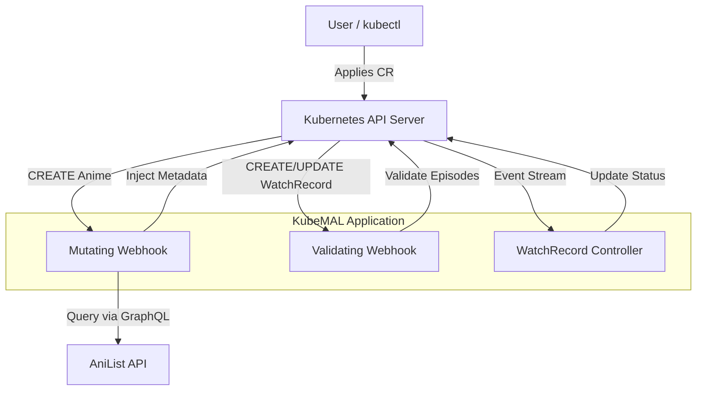
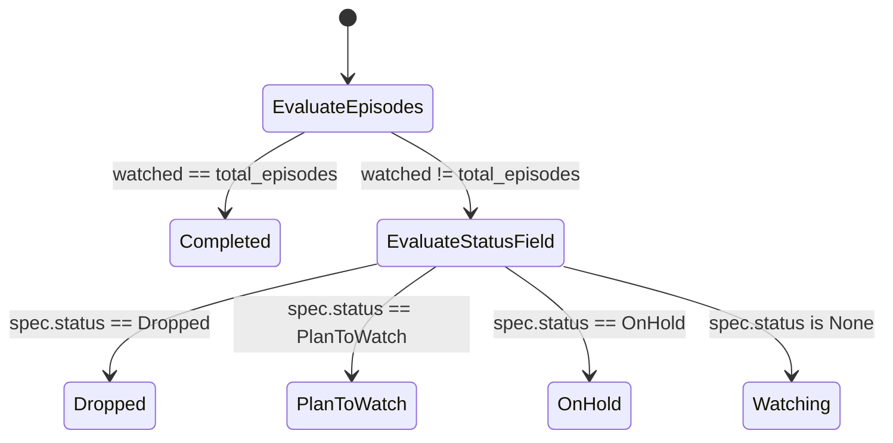

# KubeMAL

KubeMAL is a custom Kubernetes operator and admission webhook server written in Rust. It extends the Kubernetes API to function as a tracker for anime series, automatically fetching metadata from AniList and managing watch progress states through custom resources.

## Architecture

KubeMAL consists of three main components: a Mutating Webhook, a Validating Webhook, and an asynchronous Controller.



## Features

- **Mutating Webhook (`/mutate`)**: Intercepts the creation of `Anime` custom resources. It takes the provided name, queries the AniList GraphQL API, and automatically populates the resource's spec with the English title, Japanese title, total episode count, and current airing status.
- **Validating Webhook (`/validate`)**: Intercepts the creation and updates of `WatchRecord` custom resources. It validates that the watched episode count is greater than zero and does not exceed the total episode count of the referenced `Anime`.
- **Reconciliation Controller**: Continuously watches `WatchRecord` resources. It calculates the correct `watchState` (Watching, Completed, Dropped, PlanToWatch, OnHold) based on the user's progress and updates the resource's status subresource.

## Custom Resources

### Anime

The `Anime` resource represents a specific show. Due to the mutating webhook, you only need to provide a basic name, and KubeMAL will populate the rest.

**Example Input:**

```yaml
apiVersion: kubemal.kofta.app/v1
kind: Anime
metadata:
  name: tonari-no-tenshi
spec: {}
```

### WatchRecord

The `WatchRecord` resource tracks a user's progress for a specific `Anime`.

**Example Input:**

```yaml
apiVersion: kubemal.kofta.app/v1
kind: WatchRecord
metadata:
  name: tonari-no-tenshi-watch-record
spec:
  username: kofta
  episodesWatched: 11
  score: 9
  animeRef:
    name: tonari-no-tenshi
```

## State Calculation Logic

The controller updates the `WatchRecord` status based on the following logic flow:



## CI/CD and GitOps (Argo CD)

- **CI image pipeline** (`.github/workflows/build-push.yaml`): on pushes to `master` (and manual dispatch), it builds and pushes:
  - `kofta/kubemal:latest`
  - `kofta/kubemal:<commit-sha>`
- **GitOps image update**: the workflow updates `kubernetes/deploy/deployment.yaml` to the new SHA tag and pushes that commit.
- **CD with App of Apps**: `gitops/app-of-apps.yaml` points Argo CD to `gitops/apps`, which manages:
  - `cert-manager` (`gitops/apps/cert-manager.yaml`, sync-wave `-1`)
  - `kubemal` (`gitops/apps/kubemal.yaml`, sync-wave `0`)

```mermaid
flowchart TD
    A[Push to master / workflow_dispatch] --> B[GitHub Actions: build-push]
    B --> C[Build Docker image]
    C --> D[Push tags: latest + commit SHA]
    D --> E[Commit updated image tag to kubernetes/deploy/deployment.yaml]
    E --> F[Argo CD app-of-apps sync]
    F --> G[cert-manager app (wave -1)]
    F --> H[kubemal app (wave 0)]
    H --> I[Apply kubernetes/deploy manifests]
    I --> J[Cluster running updated KubeMAL]
```

## Prerequisites

To deploy KubeMAL to your cluster, you will need:

1.  A running Kubernetes cluster.
2.  `cert-manager` installed on your cluster (required for generating the self-signed TLS certificates used by the admission webhooks).
3.  `Argo CD` installed (only if you use the GitOps deployment path below).

## Deployment

### Option A: Manual `kubectl apply`

1.  **Create namespace and service account:**

    ```bash
    kubectl apply -f kubernetes/deploy/identity.yaml
    ```

2.  **Apply CRDs:**

    ```bash
    kubectl apply -f kubernetes/deploy/anime.yaml
    kubectl apply -f kubernetes/deploy/watchrecord.yaml
    ```

3.  **Apply RBAC and TLS resources:**

    ```bash
    kubectl apply -f kubernetes/deploy/rbac.yaml
    kubectl apply -f kubernetes/deploy/tls.yaml
    ```

4.  **Deploy KubeMAL workload and service:**

    ```bash
    kubectl apply -f kubernetes/deploy/deployment.yaml
    ```

5.  **Register the webhooks:**
    _Ensure the KubeMAL pods are running before applying the webhook configuration._
    ```bash
    kubectl apply -f kubernetes/deploy/webhook.yaml
    ```

### Option B: GitOps with Argo CD (App of Apps)

1.  Apply the root application:

    ```bash
    kubectl apply -n argocd -f gitops/app-of-apps.yaml
    ```

2.  Argo CD will sync child apps from `gitops/apps/`:
    - `cert-manager` first (sync-wave `-1`)
    - `kubemal` next (sync-wave `0`)

## Testing

You can test the functionality using the provided manifests in the `kubernetes/test/` directory.

1.  Create an Anime resource. You can describe it afterward to see the AniList data injected by the webhook.

    ```bash
    kubectl apply -f kubernetes/test/test-anime.yaml
    kubectl describe anime tonari-no-tenshi
    ```

2.  Create a WatchRecord.
    ```bash
    kubectl apply -f kubernetes/test/test-watchrecord.yaml
    kubectl describe watchrecord tonari-no-tenshi-watch-record
    ```
    Check the `Status` section of the WatchRecord to see the controller's computed watch state.
